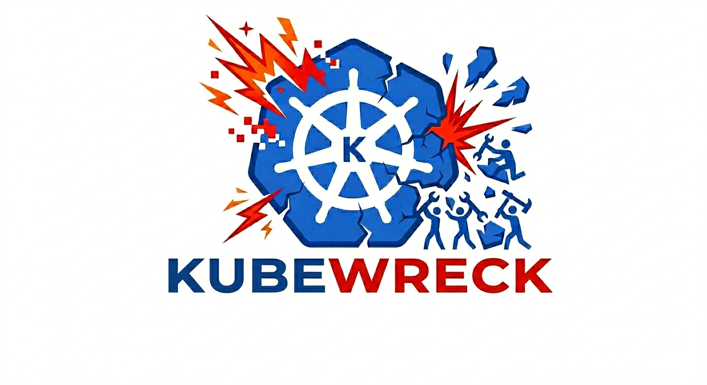

<p align="center" width="100%">
    <kbd>
        
    </kbd>
</p>

# Kubewreck App

This is a demo application which renders a static html page with
instructions on how to upgrade the application in kubernetes.

In our `kubewreck` challenges, we tinker with kubernetes resources
and maliciously block the straight forward upgrade path.
After the teams manages to mitigate all issues, the `v2` Image
displays a new version of the page


## Build

Build App and Image via:

```
task build
```

Push Image to ghcr with
```
task push
```
